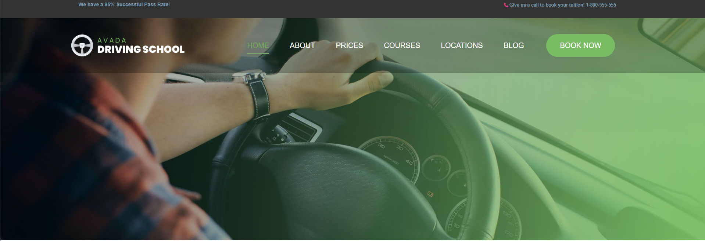

# 🚗 Driving School Landing Page

A fully responsive driving school landing page built with semantic HTML and modern CSS.

- 🔗 [Live Demo]( https://mohammadtakali.github.io/driving-school-landing-page/)
- 👨‍💻 Developed by **Mohammad Takali**
- 📅 Created - 2026-09-11
- 🛠️ Technologies Used - HTML, CSS
- 🎯 Role - Frontend Developer
- 📬 How to reach me: [Instagram](https://www.instagram.com/mohammadtakali.dev) · [GitHub](https://github.com/mohammadtakali) · [LinkedIn](https://www.linkedin.com/in/mohammad-takali-b9b820434)

## ✨ Features

- Full-height hero section with background image
- Top announcement bar with promotional messages
- Header with logo, navigation menu, and a "Book Now" call-to-action button
- Smooth underline hover animation on navigation links
- Footer section with profile photo and social links (Instagram, LinkedIn, GitHub)
- Fully responsive layout built with Flexbox
- Written with modern native CSS nesting

## 🧰 Built With

- **HTML5**
- **CSS3** — Flexbox, CSS Nesting, Custom Properties, Transitions

## 🖼️ Preview

## 📄 License

This project is licensed under the MIT License — see the [LICENSE](LICENSE) file for details.
